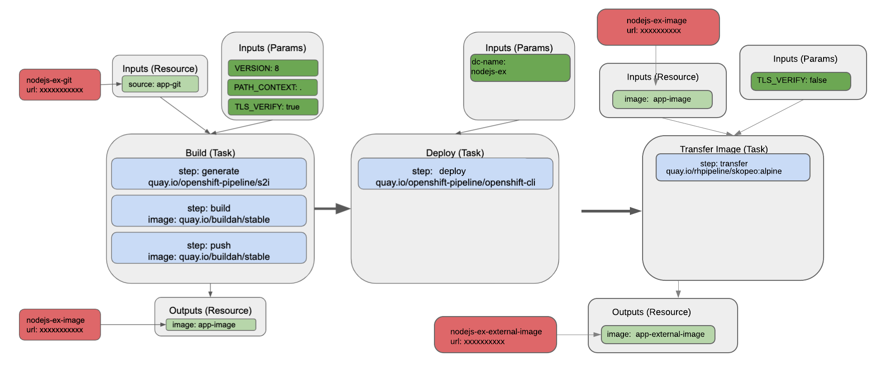
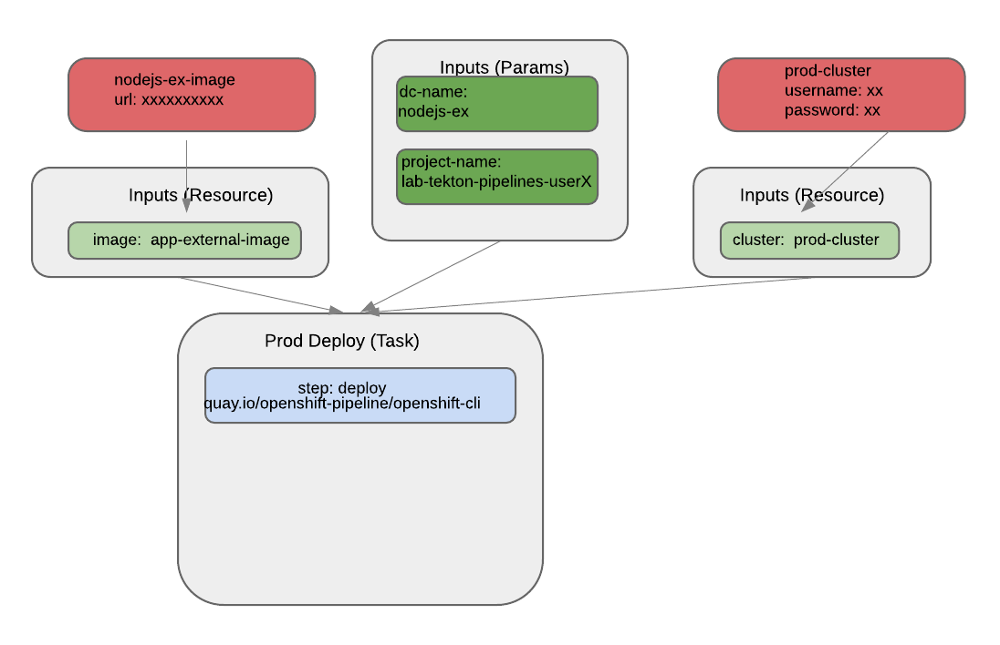

== Workshop - OpenShift Pipelines with Tekton in a Multi-Cluster Environment

=== Overview

This workshop provides an introduction to OpenShift Pipelines with
Tekton in a Multi-Cluster Environment which uses IBM Cloud for
pseudo-*prod* OpenShift cluster, and an external pseudo-*non-prod*
cluster for both running the workshop and run non-prod pipeline
operations.

Here is the basic architecture of this workshop:

The workshop will include two pipelines regarding to the infrastructure above:

==== Non-prod Pipeline

==== Prod Pipeline

The workshop uses the HomeRoom workshop environment in the learning
portal configuration. You will need to be a cluster admin in order to
deploy it.

When the URL for the workshop environment is accessed, a workshop
session will be created on demand.

=== Deploying the Workshop

To deploy the workshop, first clone this Git repository to your own
machine.

When you clone the repository, ensure you use the `--recurse-submodules`
option with the `git clone` command. Alternatively, after having cloned
the repository, within the repository directory, run:

[source,bash]
----
git submodule update --init --recursive
----

The option to `git clone`, or the `git submodule update` command, ensure
that a copy of a Git submodule which contains scripts to help you deploy
the workshop will also be cloned.

Next create a project in OpenShift into which the workshop is to be
deployed.

[source,bash]
----
oc new-project workshops
----

From within the top level of the Git repository, now run the command
below.

[source,bash]
----
.workshop/scripts/deploy-spawner.sh
----

After the deployment finishes you have to build the workshop since no image for this fork of workshop is not preferred to be provided:

[source,bash]
----
.workshop/scripts/build-workshop.sh
----

*NOTE:* The default max number of sessions (i.e. users who can access
the workshop at the same time) defaults to 50. The number for the max
number of sessions can be overridden when running the
`deploy-spawner.sh` script by supplying the `--override SERVER_LIMIT=50`
option. If 50 is not enough sessions, or too many, the amount can be
increased or decreased by changing the value from 50 to the expected
number of users. Your cluster should have enough resources to support
the number of users in your workshop. Each user is given a quota of 8Gi
of memory. If you don’t set this up front and need to change it later,
you can edit the `SERVER_LIMIT` environment variable on the spawner
deployment config. Changing it will cause all currently running sessions
to be stopped, so avoid changing it during a workshop.

When deployed the name of the deployment will be `lab-tekton-pipelines`.

You can determine the hostname for the URL to access the workshop by
running:

....
oc get route lab-tekton-pipelines
....

When the URL is accessed, you will be prompted to login. For the user
name, use your email address or other name which would uniquely identify
you. This is just used as an identifier for your session if you need to
login again to the same session again. What you use for the user name
isn’t recorded in any way. For the password, use ``openshift''.

=== Editing the Workshop

The deployment created above will use a version of the workshop which
has been pre-built into an image and which is hosted on `quay.io`.

To make changes to the workshop content and test them, edit the files in
the Git repository and then run
