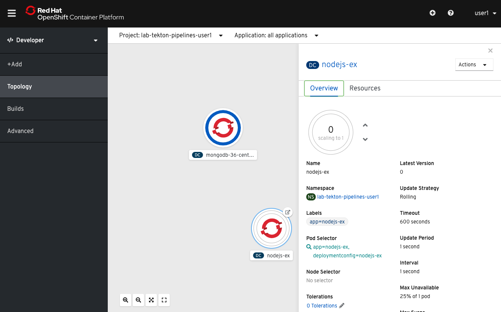

Before any deployment to production we have to setup some things on the `prod` cluster like we did to non-prod cluster before: creating the DeploymentConfig of the `nodejs-ex` application, creating its dependencies like `mongodb` etc. And we have to setup some things like image registry for the deployment to pull the image from the external one. So run the script below:

[source,bash,role=execute-1]
----
chmod a+x ./setup/prepare-prod.sh;./setup/prepare-prod.sh
----

Script will switch to the production cluster, make the preperations and switch back to the `non-prod` cluster which we run the workshop on.

After setting up the `prod`, please make sure the deployments are properly created and `mongodb` pods are running. 

For this just go to the `prod` cluster console by clicking the following link: 

http://console-openshift-console.apps.cluster-jday-prd-611a.jday-prd-611a.example.opentlc.com

Username: user**X**

Password: openshift

When the Openshift console is opened check the pods and DeploymentConfigs by switching to the lab-tekton-pipelines-user**X** project in the "Developer" perspective's topology view:

After being sure everything is setup with no problem, let's have a look at the pipeline structure you will create:

image:images/prod-pipeline-visual.png[Prod Pipeline Visualization]

Let's start by creating the task that our production deployment pipeline will use. Here is the `prod-deploy` task we will create:

[source,yaml]
----
apiVersion: tekton.dev/v1alpha1
kind: Task
metadata:
  name: prod-deploy
spec:
  inputs:
    params:
      - name: dc-name
        description: DeploymentConfig name to deploy
      - name: project-name
        description: Project namespace
    resources:
      - name: image
        type: image
      - name: prod-cluster
        type: cluster
  steps:
    - name: deploy
      image: quay.io/openshiftlabs/openshift-cli-tekton-workshop:2.0
      command:
        [
          "/bin/bash",
          "-c",
          "oc login $(inputs.resources.prod-cluster.url) --token=$(inputs.resources.prod-cluster.token) --insecure-skip-tls-verify && oc project $(inputs.params.project-name) && oc import-image $(inputs.params.dc-name) --from=$(inputs.resources.image.url):latest --confirm --insecure && oc rollout latest $(inputs.params.dc-name)",
        ]
----

Since we have a couple of more arguments like logging into the 'prod' cluster, switching to the relevant project, importing the external image registry source, we had to create another task apart from the `deploy` task we used for `non-prod` deployment. Create the task as follows:

[source,bash,role=execute-1]
----
oc create -f tektontasks/prod-deploy-task.yaml
----

Then create the following pipeline which uses the prod-deploy task you have just created:

[source,bash,role=execute-1]
----
oc create -f pipeline/prod-deploy-pipeline.yaml
----

As you have seen in the visualization of the pipeline we need two input resources for the production pipeline and its `prod-deploy` task. 

One of the pipeline resources is already created before which we used as an output of the `transfer-image` task of the `deploy-pipeline`: *nodejs-ex-external-image*

Other pipeline resource we need as an input for our `prod-deploy-pipeline` is a pipeline resource thats type must be a cluster, which includes the information about the production cluster.

[source,yaml]
----
apiVersion: tekton.dev/v1alpha1
kind: PipelineResource
metadata:
  name: prod-cluster
  labels:
    app: tekton-workshop
spec:
  type: cluster
  params:
    - name: name
      value: prod-cluster
    - name: url
      value: ${PROD_CLUSTER_URL}
    - name: username
      value: ''
    - name: password
      value: ''
    - name: token
      value: ${PROD_CLUSTER_TOKEN}
    - name: cadata
      value: ''

----

As you can see, since you already provided the relevant fields in the `prod-cluster` pipeline resource, you can directly create the resource as follows without any change:

[source,bash,role=execute-1]
----
oc create -f resources/prod-cluster-resource.yaml
----

Now that pipeline resources have been specified, you can include these as part
of our `prod-deploy-pipeline` pipeline run that will deploy the `nodejs-ex` application out to the prod OpenShift cluster. 

Next, you will trigger the pipeline you created and make a production deployment.

Clear your terminal before continuing:

[source,bash,role=execute-1]
----
clear
----