= IBM Cloud Prerequisites

Before starting to workshop, you need to sign up to IBM Cloud to receive an OpenShift cluster and to create an external private container registry. 

This section describes how you can create an IBM Cloud Account, how to create an external private container registry and how you are going to claim an OpenShift Cluster for this workshop.

* <<Creating an IBM Cloud Account>>
* <<Create An External Private Container Registry>>
* <<Create API Key to access your private registry>>
* <<Claim your OpenShift Cluster for the workshop>>

== Creating an IBM Cloud Account

If you didn't create your IBM Cloud account before the workshop, follow this section to create it. Otherwise, you can skip to the next section - <<Create An External Private Container Registry>>
.

. To create an IBM Cloud Account, go to the link that your workshop host provides you. For example *ibm.biz/xxx*

* You will see a page like below. Enter the necesseary informations to create your account. 
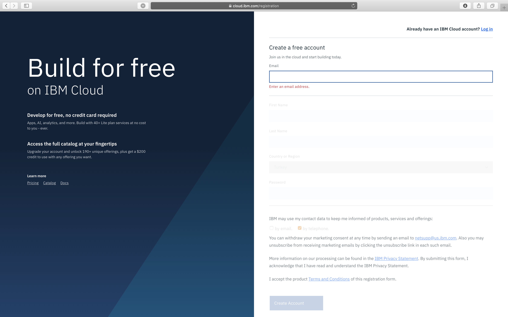

* After you click *Create Account*, you will receive a verification mail to activate your account.

* After you click to the activation link, you will be redirected to a page that says successful verification. And there will be a *Log In* button. Click that button to log in to your account.

* After you logged in to your account, you will see the privacy page. After examining the privacy rules, scroll down to the end of page to agree privacy policy to and proceed IBM Cloud dashboard.
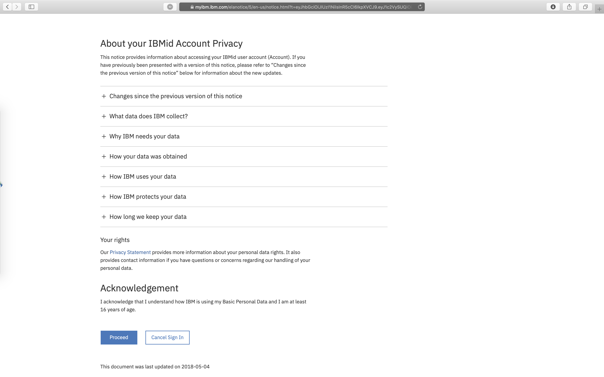

* Congratulations! You have created an IBM Cloud account!

. After logging in to your new IBM Cloud account, you will see a *Dashboard*. 

* On top left corner, you can find a navigation menu which can lead you to any service page. 

* On top, you can find a menu bar which includes a 
** *search bar*, 
** *catalog link*, 
** *documentation link*, 
** *support page link*, 
** a dropdown to *manage your account*, 
** your *accounts list*, 
** *web terminal*, 
** *cost estimator*, 
** *notifications button* and 
** your *profile button*.

. When you look to the center of the page, you will see various widgets which you can configure. Default template provides you the most used informations from maintenance to usage.
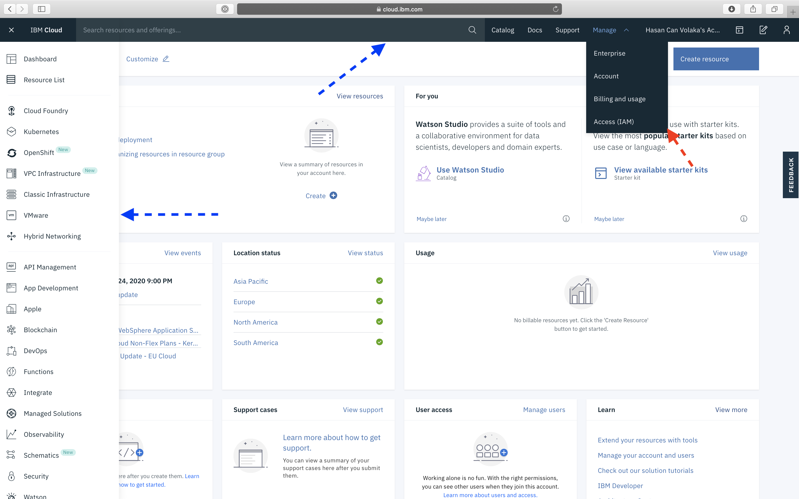

== Create An External Private Container Registry

In this section, we will create a private container registry to deploy our built container images.

. First, we need to be sure that we are on our personal account.
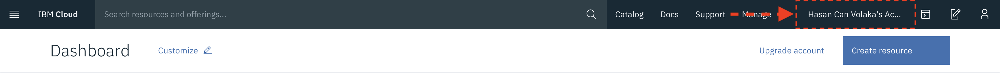

. Write "*Container Registry*" to search bar and select the item comes under _Catalog Results_
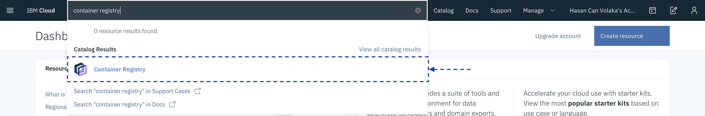

. Click to "*Create*" button which locates on top right of the page or at the bottom right of the page.
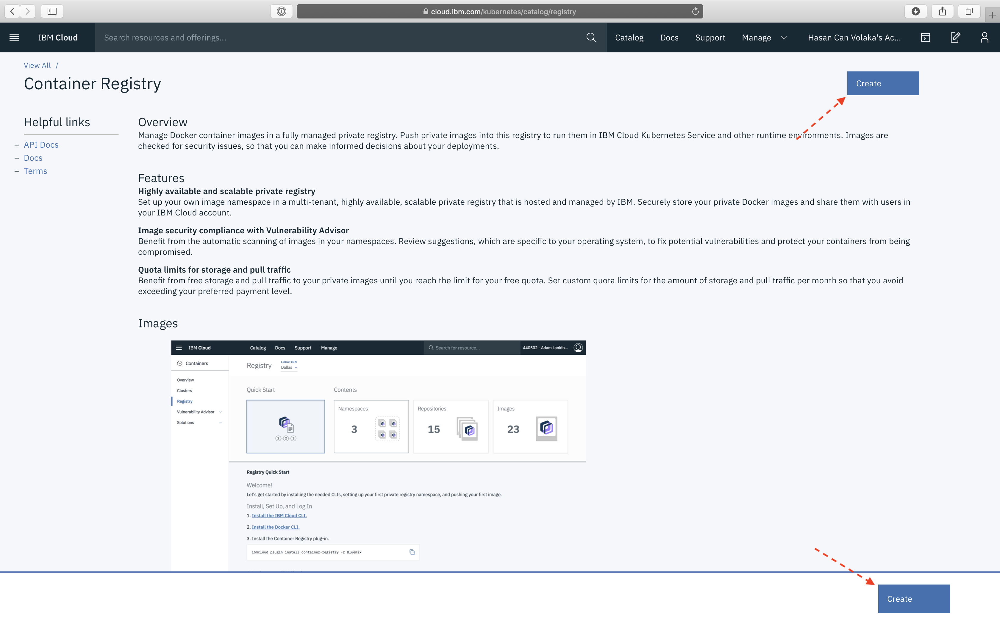

. In your container registry page:

.. Be sure that "*Dallas*" is selected as _Location_
.. Click to "*Namespaces*" tab
.. Click to "Create namespace+" button.
.. Enter your registry namespace as follows "*workshop-userX*". (X will be given to you by workshop hosts.)
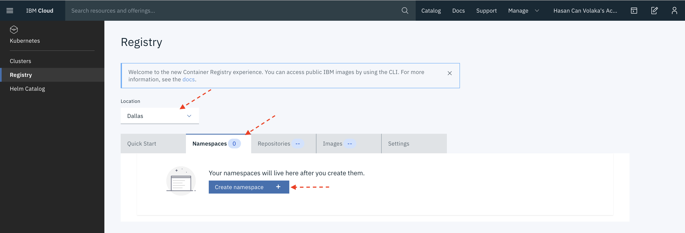

. After creating your registry namespace, you should see similar something as below:
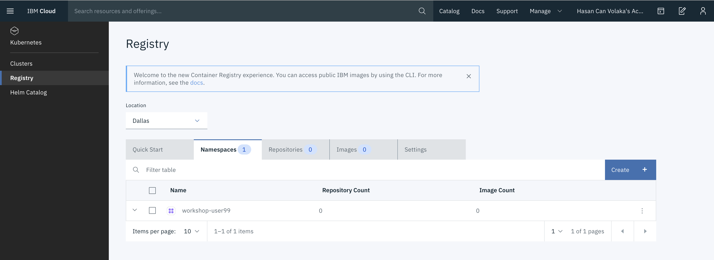

Congratulations! You have created an external private container registry.

Your registry url is as follows: *us.icr.io/workshop-userX*

== Create API Key to access your private registry

There are three ways to access our container registry. 

. ibmcloud command line tool
. global api key
. service id

The most secure way to do is to use service id way. Below, we are describing how to create a service id and a key associated to it. You can read more details from link:https://cloud.ibm.com/docs/services/Registry?topic=registry-registry_access[IBM Cloud Container Registry documentation.,window=_blank]

. Click to *Manage* dropdown. Select *Access (IAM)* item from the menu.
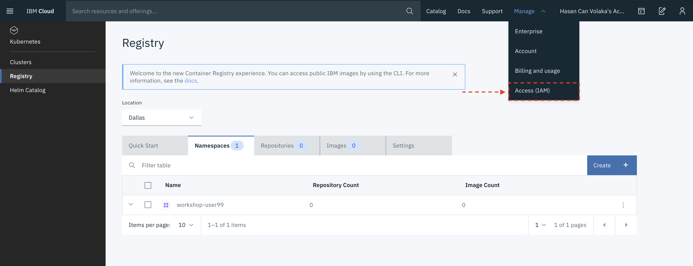

. Click to *Services IDs* item on the left menu.

. Click "Create +" button. Give a name and a description to your service id. For Ex: 
* Name: Container Registry External Access
* Description: This service id is to access private registry from ci/cd tools or from an external third party tool.

. Click to *Access Policies* tab and then click *Assign Access +* button to assign a service to this id.

. Fill the fields as showed below in the screen shot:
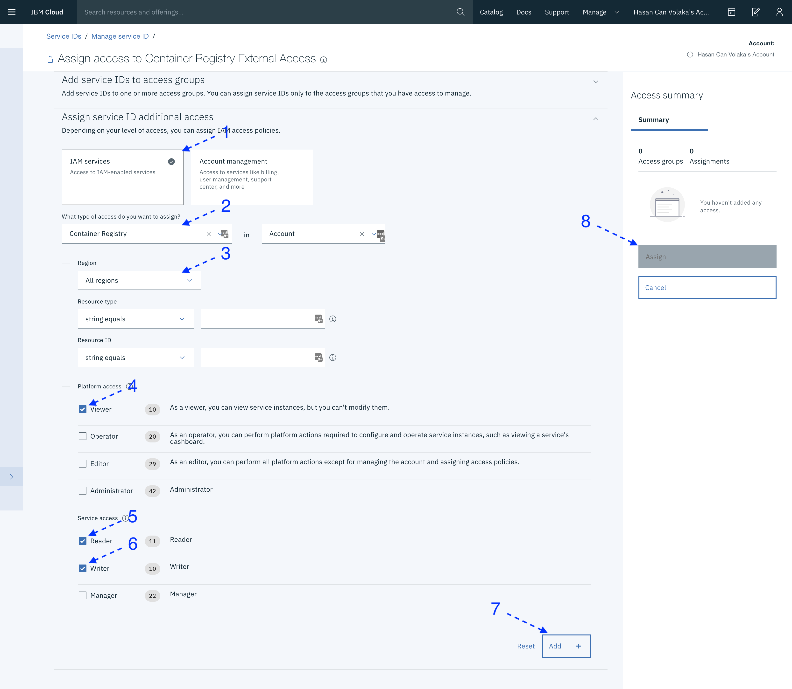

. Once your policy is created, click on the *API Keys tab*. Then click *Create +* button.
* Name: Container Registry External Access Key
* Description: This key is intended to be used by third party applications to access container registry service.

. Click to *Download* button to download your key as a JSON to your computer. Your key will be similar as follows:

[source,json]
----
{
  "name": "Container Registry External Access Key",
  "description": "This key is intended to be used by third party applications to access container registry service.",
  "createdAt": "2020-02-20T15:46+0000",
  "apikey": "xxxxx"
}
----

Congratulations! Now you can access to your private registry from any docker host using:

[source,bash]
----
docker login -u iamapikey -p <your_apikey> us.icr.io/<your-namespace>
----

  P.S. iamapikey must be the user name.

== Claim your OpenShift Cluster for the workshop

In this section, you will claim an OpenShift cluster to use in the workshop.

. Go to the URL which your workshop host provides.
* Lab Key: provided by the host
* Your IBMid: the email address you used to register IBM Cloud.
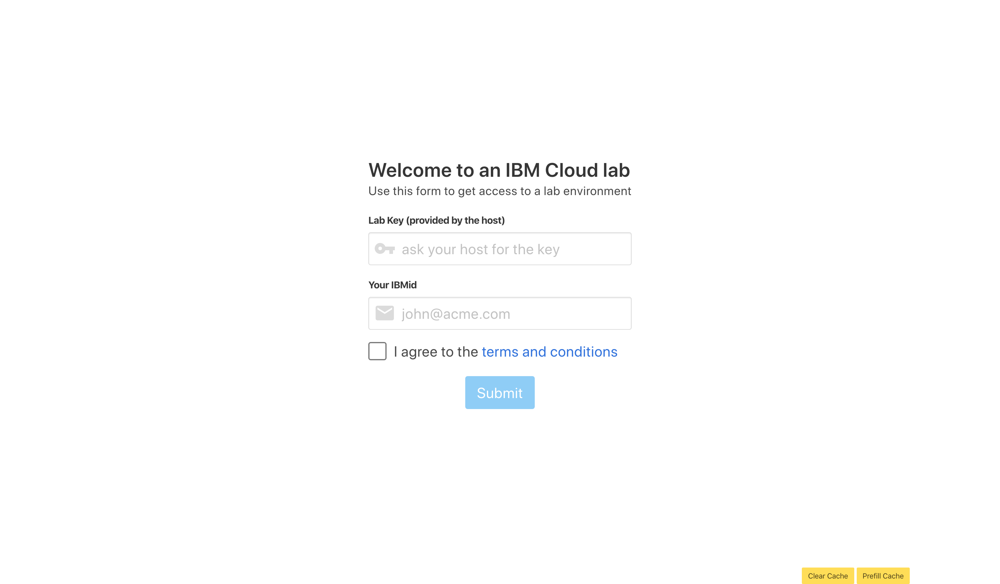

. Once you enter your email and the lab key, click to submit and wait until you see "*Congratulations! You have been assigned a openshift cluster.*".

. Log in to your account or go to your dashboard if your logged in already. 

. Click to "*Account's Dropdown*" and select the account *1849867 - IBM*.

. Click to *Clusters* item on resources widget.
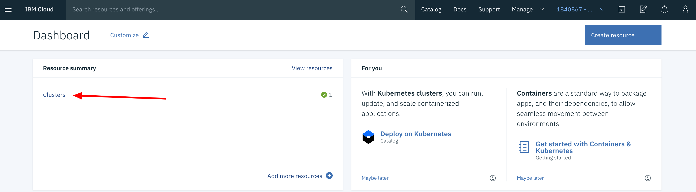

. Select your OpenShift cluster from the list
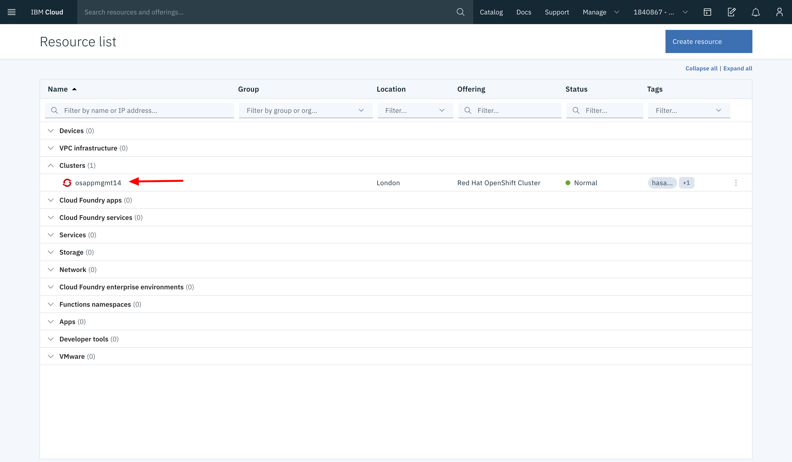

. Click to "*OpenShift Web Console*" button to access your clusters console screen.
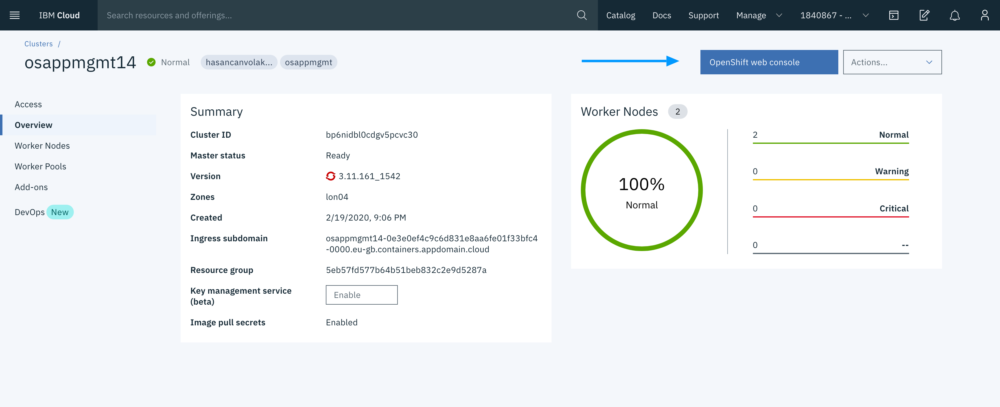
